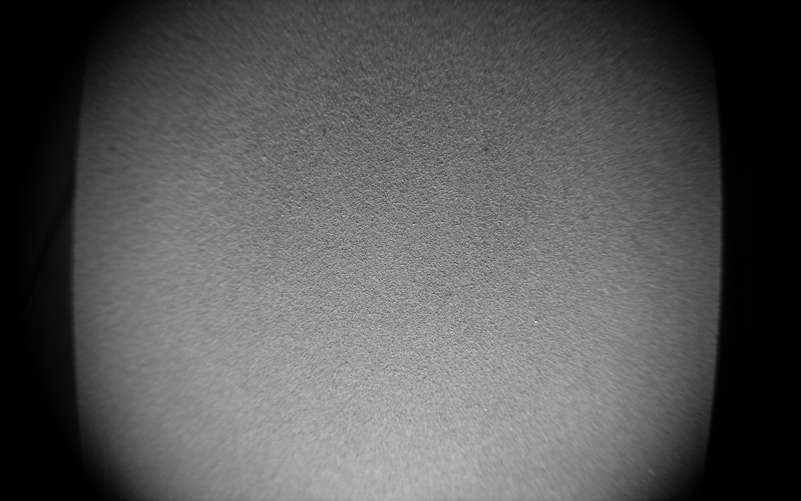
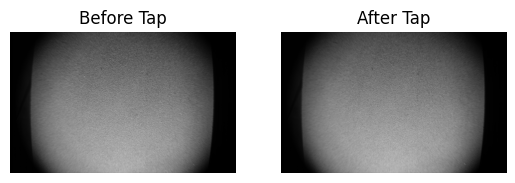
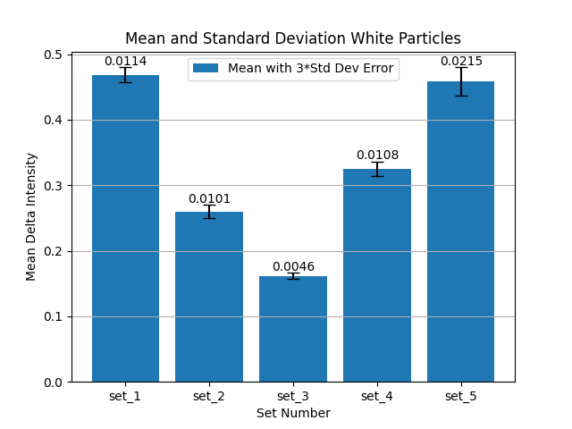
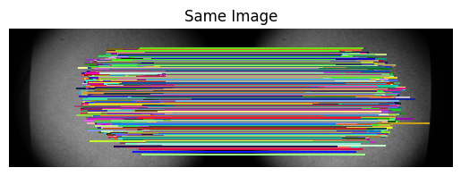

# White Particles - Black Background
In this test, the particles are seen as white pixel with higher intensity denoting higher particle density. The background for this experiment is a black coated sheet metal. 

[comment]: <> (Add black sheet metal picture)

*Figure 1: Example image of pictures taken.*

## Intensity Result
Below is an example of the particles distribution after tapping.

*Figure 2: Comparison of before and after tap.*

We can see that the particles have moved. The measured intensity for each 10 trials are shown below in Figure 3.

*Figure 3: Delta Intensity For Each Trial.*

From Figure 3, we can see that the intensity for particular density stays constant. Tapping the particles in between trial causes the particles to be redistributed. The relatively constant intensity indicates that the redistribution of the particles does not affect the intensity of the image. 

The mean and 3 standard deviation of each set is shown below 

*Figure 4: 3 std for each trial.*
We can see that the maximum fluctuations between test is about 0.02. This is within the range of error, the std of a the same plate imaged 10 times is about 0.01. 

## Randomness Result
To ensure that the particles are randomly distributed and not simply shifted over, we employ the SIFT algorithm. The SIFT algorithm helps locate the local features in an image, commonly known as the 'keypoints' of the image. These 'keypoints' are then identified between the images and matched. Similar picture will have high number of matches.
For example, here is the same two picture side by side.

*Figure 5 SIFT algorithm between two same picture*

Below is some outputs of the SIFT algorithm by comparing pictures 2-10 to the original picture, picture 1. 

*Figure 6 SIFT algorithm - Set 1*

*Figure 7 SIFT algorithm - Set 2*

We can clearly see that the number of matches is relatively low compared, indicating that the particles are distributed randomly.